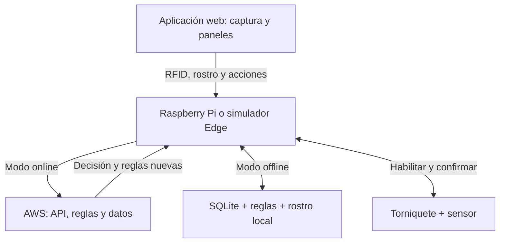
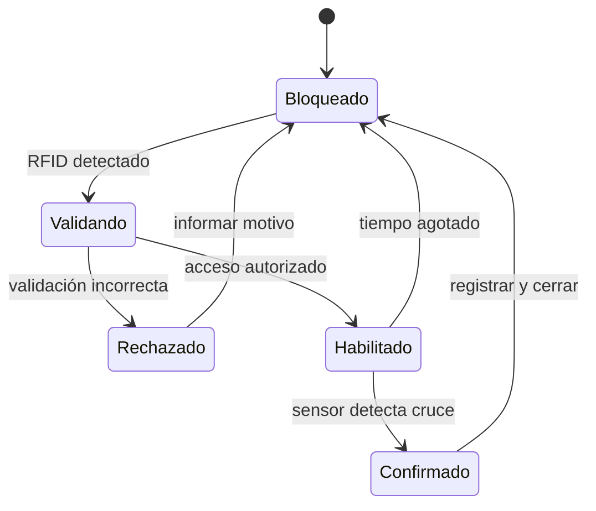
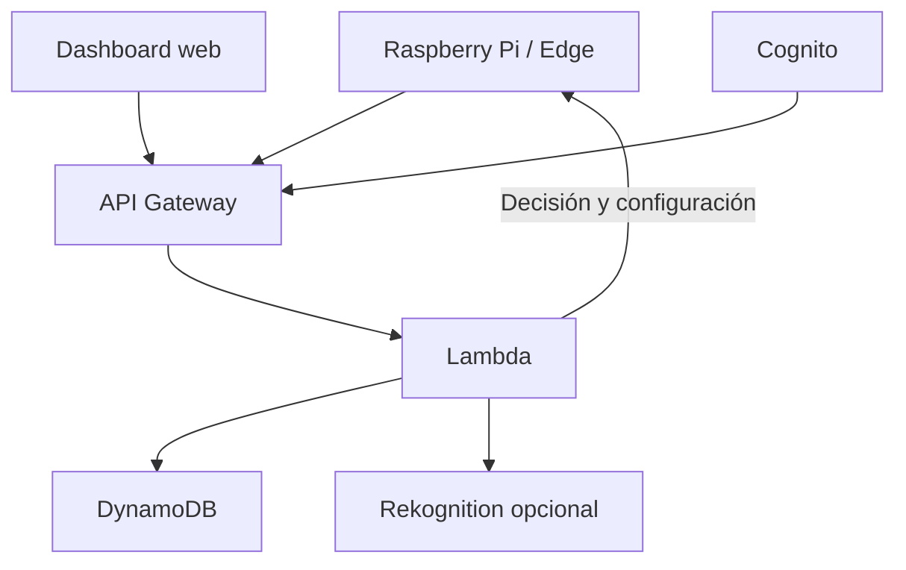
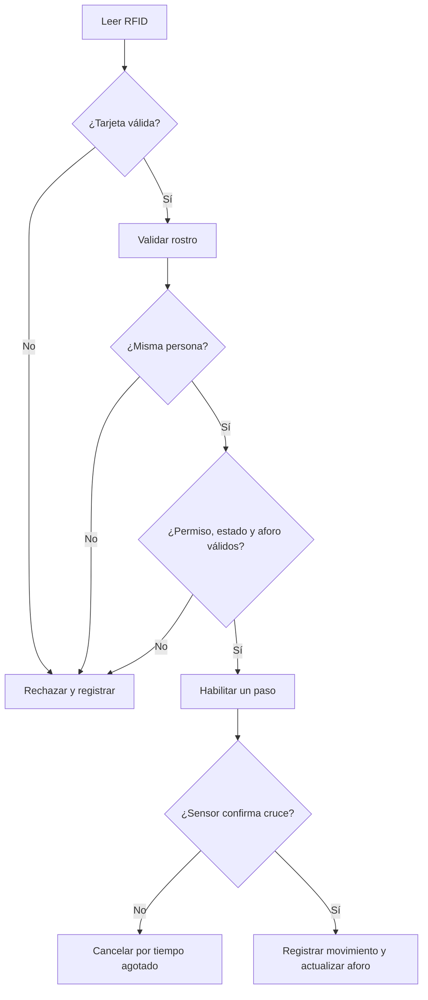

<div align="center">

# Project You Shall Not Pass — Fase 1

## Control de acceso y aforo con RFID, reconocimiento facial y AWS

### *You shall not pass... sin RFID y reconocimiento facial.*


| Campo | Detalle |
|:---|:---|
| **Institución** | Instituto Profesional Duoc UC |
| **Sede** | Plaza Norte |
| **Asignatura** | SIY6122 - Problemáticas Globales y Prototipado |
| **Evaluación** | Experiencia Práctica 1 (EP1) |
| **Sección** | 002V |
| **Experiencia** | Programando dispositivos para el IoT |
| **Caso** | Caso 02 - Control de acceso y aforo para sala o laboratorio |
| **Proyecto** | Project You Shall Not Pass |
| **Plataforma principal** | Aplicación web desarrollada en Visual Studio Code |
| **Controlador local** | Raspberry Pi 4 o servicio Edge simulado en un computador |
| **Servicios cloud previstos** | Amazon Cognito, API Gateway, Lambda, DynamoDB, Rekognition, S3 y CloudWatch |
| **Entorno AWS inicial** | AWS Academy Learner Lab de Duoc UC |
| **Integrantes** | Abraham Castro Romero · Sebastián Fuentes Cortés · Lisandra González Hernández · Felipe Murúa Lobos · Bárbara Saavedra Fernández |
| **Docente** | Marcos Antonio Perelli Henríquez |
| **Fecha** | Septiembre 2026 |

</div>

---

## 👋 Guía para comenzar

Si es tu primera vez trabajando con estas herramientas, comienza por la [guía sencilla para principiantes](docs/guia-para-principiantes.md).

Antes de programar, revisa también el [stack tecnológico](docs/stack-tecnologico.md), el [plan de implementación](docs/plan-implementacion.md) y las [reglas para colaborar](CONTRIBUTING.md).

---

## 📋 Contenido

- [1. Alcance de la Fase 1](#1-alcance-de-la-fase-1)
- [2. Análisis del problema](#2-análisis-del-problema)
- [3. Objetivo del prototipo](#3-objetivo-del-prototipo)
- [4. Solución propuesta](#4-solución-propuesta)
- [5. Usuarios y permisos](#5-usuarios-y-permisos)
- [6. Entradas y salidas](#6-entradas-y-salidas)
- [7. Reglas de acceso](#7-reglas-de-acceso)
- [8. Funcionamiento del torniquete](#8-funcionamiento-del-torniquete)
- [9. Registro de visitantes](#9-registro-de-visitantes)
- [10. Simulación distribuida](#10-simulación-distribuida)
- [11. Arquitectura en AWS](#11-arquitectura-en-aws)
- [12. Base de datos](#12-base-de-datos)
- [13. Seguridad y trazabilidad](#13-seguridad-y-trazabilidad)
- [14. Diseño lógico previo](#14-diseño-lógico-previo)
- [15. Pseudocódigo conceptual](#15-pseudocódigo-conceptual)
- [16. Pruebas previstas](#16-pruebas-previstas)
- [17. Estructura preparada para la implementación](#17-estructura-preparada-para-la-implementación)
- [18. Revisión de requisitos](#18-revisión-de-requisitos)
- [19. Próxima fase](#19-próxima-fase)
- [20. Diseño 2.0](#20-diseño-20)

---

## 1. Alcance de la Fase 1

Esta fase corresponde al análisis y diseño conceptual de un prototipo virtual para controlar el acceso y el aforo de una oficina. El propósito es definir el comportamiento completo antes de implementar la aplicación web, los servicios de AWS y la simulación electrónica.

En esta etapa:

- Se analiza el problema de acceso y control de aforo.
- Se establecen los actores, permisos, entradas, salidas y estados.
- Se define la validación conjunta mediante RFID y rostro.
- Se incorpora una regla de anti-passback para impedir entradas duplicadas.
- Se diseña el registro temporal de visitantes.
- Se propone una arquitectura compatible con AWS Academy Learner Lab.
- Se define cómo se unirán la aplicación web, el servicio Edge, la Raspberry Pi y AWS.
- Se prepara una estructura de repositorio que podrá recibir el código futuro sin reorganizar el proyecto.

> **Importante:** todavía no se incluyen credenciales reales, fotografías biométricas, circuitos definitivos ni servicios productivos. Las primeras pruebas deberán realizarse con usuarios e identidades ficticias.

---

## 2. Análisis del problema

Una oficina necesita conocer quién entra, quién sale y cuántas personas permanecen en su interior. Un control únicamente visual o manual puede producir registros incompletos, permitir el uso de tarjetas ajenas y dificultar la comprobación del aforo en tiempo real.

El sistema debe resolver los siguientes problemas:

1. Una tarjeta RFID perdida podría ser utilizada por otra persona.
2. Una persona podría intentar registrar más de una entrada sin haber salido.
3. El contador de aforo podría quedar incorrecto si se registra una autorización pero nadie atraviesa el torniquete.
4. Los visitantes externos necesitan permisos limitados y temporales.
5. Las acciones manuales de los guardias deben quedar identificadas.
6. Los administradores y guardias no deben tener los mismos permisos.
7. Los registros deben mantenerse centralizados para poder consultarlos desde diferentes computadores.

---

## 3. Objetivo del prototipo

Crear un prototipo virtual que valide una tarjeta RFID y un rostro, habilite un torniquete simulado para un único paso, registre entradas y salidas y mantenga actualizado el aforo de una oficina.

El prototipo también deberá:

- Registrar la fecha y hora de cada movimiento.
- Contabilizar los ingresos diarios de cada persona.
- Guardar accesos autorizados y rechazados.
- Bloquear tarjetas reportadas como perdidas.
- Impedir una segunda entrada mientras la persona figure dentro.
- Permitir visitas autorizadas solamente durante el día definido.
- Entregar al guardia un panel limitado a sus funciones.
- Entregar al administrador una vista completa de configuración y auditoría.

---

## 4. Solución propuesta

La solución utilizará una arquitectura híbrida: AWS será la plataforma principal y un servicio Edge compatible con Raspberry Pi mantendrá una continuidad local controlada.

| Parte | Responsabilidad |
|:---|:---|
| **Aplicación web** | Capturar RFID y rostro; mostrar terminal, panel del guardia y dashboard administrativo |
| **Raspberry Pi / Edge** | Coordinar solicitudes, controlar el torniquete, mantener la copia offline y sincronizar eventos |
| **AWS** | Autenticación, reglas oficiales, reconocimiento facial online, base de datos y auditoría |
| **SQLite local** | Reglas vigentes, aforo, presencia y eventos pendientes durante una interrupción |

La aplicación ejecutada en el navegador no reconocerá el rostro ni decidirá el acceso. Con AWS disponible, Rekognition y Lambda procesarán la solicitud. Sin AWS, la Raspberry utilizará la última configuración válida durante un máximo de 12 horas. Durante la simulación, un proceso separado en el computador representará esa Raspberry.



La explicación por capas, los flujos online/offline y el recorrido de los datos se encuentran en [Arquitectura híbrida — Diseño 2.0](docs/arquitectura.md).

---

## 5. Usuarios y permisos

### 5.1 Roles previstos

| Función | Guardia | Administrador |
|:---|:---:|:---:|
| Iniciar sesión | ✅ | ✅ |
| Ver aforo y personas presentes | ✅ | ✅ |
| Ver solicitudes pendientes | ✅ | ✅ |
| Registrar y autorizar visitantes | ✅ | ✅ |
| Finalizar una visita | ✅ | ✅ |
| Reportar una tarjeta perdida | ✅ | ✅ |
| Crear trabajadores permanentes | ❌ | ✅ |
| Asignar tarjetas y rostros | ❌ | ✅ |
| Cambiar permisos permanentes | ❌ | ✅ |
| Cambiar la capacidad máxima | ❌ | ✅ |
| Administrar cuentas de guardias | ❌ | ✅ |
| Eliminar registros históricos | ❌ | ❌ |

Los botones ocultos en la interfaz no serán la única protección. AWS Lambda deberá comprobar el rol en cada operación protegida.

### 5.2 Autenticación

Amazon Cognito se utilizará para autenticar al guardia y al administrador. En el AWS Academy Learner Lab utilizado por el equipo se confirmó acceso de lectura al servicio en la región `us-east-1`. La creación del User Pool se comprobará durante la implementación.

---

## 6. Entradas y salidas

### 6.1 Entradas

| Entrada | Origen | Uso |
|:---|:---|:---|
| UID de tarjeta | Lector virtual de la aplicación o futuro lector conectado a Raspberry | Identificar la credencial presentada |
| Rostro | Webcam o identidad ficticia | Confirmar la identidad asociada a la tarjeta |
| Dirección | Lector de entrada o salida | Determinar el movimiento solicitado |
| Sensor de paso | Simulador Edge, botón web o futuro sensor conectado a la Raspberry | Confirmar que la persona realmente cruzó |
| Capacidad máxima | Configuración administrativa | Impedir el ingreso cuando no exista espacio |
| Datos del visitante | Formulario del guardia | Crear una autorización temporal |
| Reporte de pérdida | Guardia o administrador | Bloquear inmediatamente una credencial |

### 6.2 Salidas

| Salida | Función |
|:---|:---|
| Torniquete virtual | Permanecer bloqueado o habilitar un solo paso |
| Luz verde | Acceso autorizado |
| Luz amarilla | Validación pendiente o aforo cercano al máximo |
| Luz roja | Acceso rechazado o aforo completo |
| Pantalla | Mostrar instrucciones, resultado y motivo del rechazo |
| Dashboard | Mostrar aforo, personas presentes, visitas y movimientos |
| Registro AWS | Conservar cada evento autorizado, rechazado o corregido |

---

## 7. Reglas de acceso

Una entrada normal será autorizada únicamente cuando se cumplan todas estas condiciones:

1. La tarjeta existe y está activa.
2. La tarjeta no fue reportada como perdida.
3. El rostro corresponde al propietario de la tarjeta.
4. La persona tiene un permiso vigente.
5. La persona figura actualmente como `FUERA`.
6. El aforo actual es menor que la capacidad máxima.
7. El torniquete se encuentra disponible.

Una salida normal deberá confirmar la identidad y que la persona figure como `DENTRO`. El contador nunca podrá ser negativo ni superar la capacidad máxima.

### 7.1 Anti-passback

Después de una entrada confirmada, el estado de la persona cambia de `FUERA` a `DENTRO`. El sistema rechazará cualquier nueva entrada hasta que se confirme su salida.

Esta regla ayuda a detectar el uso de una tarjeta perdida o prestada:

```text
ACCESO RECHAZADO: LA CREDENCIAL YA REGISTRA UNA ENTRADA ACTIVA
```

### 7.2 Autorización de un solo paso

Validar correctamente la tarjeta y el rostro no registra inmediatamente una entrada. Primero se crea una autorización de corta duración. El movimiento se guarda solamente cuando el sensor confirma que la persona atravesó el torniquete.

Si nadie cruza antes de vencer el tiempo, la autorización se cancela y el aforo no cambia.

---

## 8. Funcionamiento del torniquete



Estados principales:

- `BLOQUEADO`: estado normal del torniquete.
- `VALIDANDO`: espera la validación de RFID y rostro.
- `HABILITADO`: permite un único paso por tiempo limitado.
- `CONFIRMADO`: el sensor detectó el cruce y se registra el movimiento.
- `RECHAZADO`: mantiene el bloqueo y muestra el motivo.

---

## 9. Registro de visitantes

El guardia podrá crear una autorización temporal ingresando:

- Nombre completo.
- Documento de identificación ficticio durante las pruebas.
- Empresa de procedencia.
- Persona visitada.
- Motivo de la visita.
- Hora de inicio y hora de vencimiento.
- Credencial temporal o autorización manual.

El permiso vencerá automáticamente al terminar el día o al alcanzarse la hora indicada. Cada autorización deberá registrar el identificador del guardia responsable.

El guardia podrá finalizar la visita, pero no convertir al visitante en trabajador permanente ni ampliar sus permisos fuera de las reglas definidas.

---

## 10. Simulación distribuida

La demostración podrá realizarse en dos o más computadores. El servicio Edge se simulará inicialmente en un computador y conservará el mismo contrato que utilizará una Raspberry Pi 4 futura.

| Computador | Demostración |
|:---|:---|
| **PC 1** | Servicio Edge, RFID, webcam y torniquete virtual |
| **PC 2** | Panel limitado del guardia |
| **PC 3 opcional** | Dashboard completo del administrador |

Ejemplo de demostración:

1. En PC 1 se presenta una tarjeta virtual.
2. La aplicación captura o simula el rostro y envía ambos datos al servicio Edge.
3. Si AWS está disponible, el Edge reenvía la solicitud para validar identidad y reglas.
4. Si AWS no responde, el Edge utiliza la última configuración local vigente.
5. El servicio correspondiente devuelve una autorización o rechazo.
6. El Edge habilita virtualmente un solo paso.
7. El sensor confirma el paso.
8. El dashboard actualiza el aforo y el historial online o deja el evento pendiente de sincronización.

---

## 11. Arquitectura en AWS

| Servicio | Uso previsto |
|:---|:---|
| **Amazon Cognito** | Inicio de sesión y roles de guardia y administrador |
| **Amazon API Gateway** | API HTTPS utilizada por el dashboard y el servicio Edge |
| **AWS Lambda** | Validación online, anti-passback, visitantes, aforo, configuración Edge y sincronización |
| **Amazon DynamoDB** | Personas, tarjetas, permisos, estados y eventos |
| **Amazon S3** | Archivos estáticos del frontend y recursos autorizados |
| **Amazon Rekognition** | Comparación facial, solamente si Learner Lab lo permite |
| **Amazon CloudWatch** | Logs, errores y observabilidad |

No se utilizarán inicialmente servidores EC2, RDS ni NAT Gateway. La arquitectura serverless disminuye los recursos permanentes y facilita trasladar el proyecto a otra cuenta de Learner Lab.



Más detalles: [Arquitectura híbrida — Diseño 2.0](docs/arquitectura.md).

---

## 12. Base de datos

La primera versión utilizará entidades lógicas separadas para facilitar el aprendizaje:

| Entidad | Información principal |
|:---|:---|
| **Personas** | Identidad, tipo, estado dentro/fuera y permisos |
| **Tarjetas** | UID, propietario, estado y fecha de bloqueo |
| **Visitantes** | Motivo, anfitrión, vigencia y guardia autorizador |
| **Solicitudes** | RFID, rostro, torniquete, dirección, resultado y vencimiento |
| **Movimientos** | Entrada/salida, fecha, hora, método y resultado |
| **Aforo** | Capacidad máxima y ocupación actual |
| **Usuarios** | Referencia a Cognito, rol y estado de la cuenta |
| **Dispositivos Edge** | Identidad, ubicación, modo y última sincronización |
| **Configuración local** | Versión, vigencia e integridad de las reglas offline |
| **Eventos pendientes** | Movimientos offline que todavía no confirma AWS |

La cantidad de ingresos diarios se calculará consultando los movimientos de entrada confirmados. Si fuera necesario mejorar el rendimiento, posteriormente se podrá incorporar un contador diario por persona.

Más detalles: [Modelo de datos](docs/modelo-datos.md).

---

## 13. Seguridad y trazabilidad

- No se guardarán claves de AWS dentro del repositorio.
- El servicio Edge y el dashboard llamarán a una API; solamente el backend utilizará permisos AWS mediante `LabRole`.
- La aplicación no tomará decisiones de acceso ni almacenará capturas faciales.
- La copia local de permisos tendrá versión, integridad y vencimiento de 12 horas.
- Los eventos offline se enviarán posteriormente con identificadores únicos para evitar duplicados.
- Las variables propias de cada cuenta se mantendrán fuera del código.
- Los registros históricos no podrán modificarse ni eliminarse desde el dashboard; su eliminación o anonimización se realizará solo mediante la política de conservación.
- Toda corrección manual guardará usuario, fecha, hora y motivo.
- Las fotografías reales requerirán consentimiento y controles adicionales.
- Durante la fase inicial se usarán identidades y rostros ficticios.
- Cada solicitud tendrá un identificador único para evitar duplicados.

Más detalles: [Roles y seguridad](docs/seguridad-y-roles.md) y [Cumplimiento legal](docs/cumplimiento-legal.md).

---

## 14. Diseño lógico previo



---

## 15. Pseudocódigo conceptual

```text
AL RECIBIR una lectura RFID:
    CREAR solicitud pendiente con identificador único

    SI AWS está disponible:
        PROCESAR rostro y reglas en AWS
    SINO SI la configuración local tiene menos de 12 horas:
        PROCESAR rostro y reglas en el servicio Edge
        MARCAR cualquier evento confirmado como pendiente de sincronización
    SINO:
        ACTIVAR modo restringido
        PERMITIR salidas y exigir excepción auditada para nuevas entradas

    SI la tarjeta no existe, está bloqueada o fue reportada perdida:
        RECHAZAR solicitud
        REGISTRAR intento y motivo
        TERMINAR

    ESPERAR rostro o identidad ficticia

    SI el rostro no corresponde al propietario de la tarjeta:
        RECHAZAR solicitud
        REGISTRAR intento y motivo
        TERMINAR

    SI la dirección es ENTRADA:
        VERIFICAR que la persona esté FUERA
        VERIFICAR permiso vigente
        VERIFICAR aforo disponible

    SI la dirección es SALIDA:
        VERIFICAR que la persona esté DENTRO

    SI alguna regla falla:
        RECHAZAR solicitud
        REGISTRAR intento y motivo
        TERMINAR

    HABILITAR el torniquete para un solo paso
    ESPERAR confirmación del sensor durante un tiempo limitado

    SI el sensor confirma el cruce:
        GUARDAR entrada o salida
        CAMBIAR estado DENTRO/FUERA
        ACTUALIZAR aforo
        ACTUALIZAR ingresos diarios
        BLOQUEAR nuevamente el torniquete
    SINO:
        CANCELAR autorización
        MANTENER aforo sin cambios
```

---

## 16. Pruebas previstas

| Prueba | Resultado esperado |
|:---|:---|
| Tarjeta y rostro correctos | Habilitar un paso |
| Tarjeta válida con rostro incorrecto | Rechazar y registrar |
| Tarjeta desconocida | Rechazar y registrar |
| Tarjeta reportada perdida | Rechazar y alertar al guardia |
| Segunda entrada sin salida | Rechazar por anti-passback |
| Salida de persona que figura fuera | Rechazar sin disminuir el aforo |
| Aforo máximo alcanzado | Mantener el torniquete bloqueado |
| Autorización sin cruce | Cancelar sin modificar el aforo |
| Cruce confirmado | Registrar movimiento y actualizar aforo |
| Visitante dentro del horario | Autorizar según permiso temporal |
| Visitante con permiso vencido | Rechazar |
| Guardia intenta función administrativa | Rechazar por permisos |
| Corrección manual autorizada | Registrar guardia, fecha, hora y motivo |
| AWS falla con configuración vigente | Continuar en modo offline |
| Configuración local cumple 12 horas | Restringir entradas automáticas |
| AWS regresa | Sincronizar eventos sin duplicar y descargar reglas nuevas |

La matriz completa se encuentra en [Casos de prueba](docs/casos-prueba.md).

---

## 17. Estructura preparada para la implementación

```text
Project_You_Shall_Not_Pass/
├── README.md
├── CONTRIBUTING.md
├── .gitignore
├── docs/
│   ├── README.md
│   ├── guia-para-principiantes.md
│   ├── stack-tecnologico.md
│   ├── plan-implementacion.md
│   ├── arquitectura.md
│   ├── casos-prueba.md
│   ├── modelo-datos.md
│   ├── seguridad-y-roles.md
│   ├── cambios-diseno-1.1.md
│   ├── cambios-diseno-2.0.md
│   ├── decisiones-tecnicas.md
│   ├── estados-acceso.md
│   ├── modos-operacion.md
│   ├── cumplimiento-legal.md
│   ├── costos-y-migracion-aws.md
│   └── openapi.yaml
├── frontend/
│   └── README.md
├── backend/
│   └── README.md
├── infrastructure/
│   └── README.md
└── edge/
    └── README.md
```

Las carpetas permanecerán estables durante las siguientes fases:

- `frontend/`: aplicación web y dashboards.
- `backend/`: funciones Lambda y lógica de negocio.
- `edge/`: simulador local y futuro servicio de Raspberry Pi.
- `infrastructure/`: plantillas para recrear AWS en otra cuenta.
- `docs/`: decisiones, diagramas y evidencias de pruebas.

Las direcciones, nombres de tablas, región e identificadores de cada cuenta se configurarán con variables de entorno. Así será posible pasar a otro Learner Lab sin modificar la lógica principal.

---

## 18. Revisión de requisitos

| Requisito | Consideración en la Fase 1 | Estado |
|:---|:---|:---:|
| Contar entradas y salidas | Eventos confirmados por sensor | ✅ Diseñado |
| Definir capacidad máxima | Configuración administrativa | ✅ Diseñado |
| Mostrar disponible, casi lleno o lleno | Dashboard e indicadores | ✅ Diseñado |
| Impedir valores negativos | Validación transaccional en backend | ✅ Diseñado |
| RFID | Virtual en web y futuro lector conectado a Raspberry | ✅ Diseñado |
| Reconocimiento facial | `MOCK`, Rekognition online y proveedor local futuro | ✅ Diseñado |
| Anti-passback | Estado FUERA/DENTRO por persona | ✅ Diseñado |
| Registrar fecha y hora | Historial de movimientos | ✅ Diseñado |
| Contar ingresos diarios | Consulta o contador diario | ✅ Diseñado |
| Visitantes por el día | Permiso temporal creado por guardia | ✅ Diseñado |
| Roles guardia/administrador | Cognito y validación en Lambda | ✅ Diseñado |
| Simulación en dos computadores | Edge y dashboard conectados a AWS | ✅ Diseñado |
| Continuidad sin AWS | Configuración local válida por 12 horas | ✅ Diseñado |
| Implementación web | Base React, Vite y TypeScript creada | 🟡 En progreso |
| Simulador Edge | Todavía no construido | ⏳ Fase posterior |
| Pruebas integradas | Todavía no ejecutadas | ⏳ Fase posterior |

---

## 19. Próxima fase

En la Fase 2 se deberá:

1. Reemplazar la pantalla de ejemplo del frontend por el simulador de acceso.
2. Implementar identidades ficticias y RFID virtual.
3. Separar las reglas de acceso de la interfaz.
4. Crear el servicio Edge simulado.
5. Conectar el Edge con `/api/v1/health` y la API de AWS.
6. Incorporar SQLite, configuración versionada y eventos pendientes.
7. Probar los modos `ONLINE`, `OFFLINE_VALID` y `OFFLINE_EXPIRED`.
8. Construir los paneles de guardia y administrador.
9. Evaluar Rekognition y el proveedor facial local de manera controlada.
10. Registrar los resultados de cada prueba y recuperación.

> Las reglas, roles, campos de visitantes y capacidad máxima deberán ser revisados por todo el equipo antes de comenzar la implementación.

---

## 20. Diseño 2.0

El Diseño 2.0 conserva las reglas del Diseño 1.1 e incorpora:

- Raspberry Pi 4 o simulador Edge como controlador local.
- AWS como plataforma principal y fuente oficial.
- Procesamiento facial fuera de la PC.
- Rekognition online y proveedor `LOCAL` offline.
- SQLite para reglas vigentes y eventos pendientes.
- Sincronización al iniciar, cada 5 minutos y al recuperar AWS.
- Vigencia offline de 12 horas antes del modo restringido.
- Flujos separados para acceso online, offline y recuperación.
- API v1 ampliada sin romper las rutas existentes.
- Pruebas de continuidad, sincronización e integridad de configuración.

Documentos: [arquitectura híbrida](docs/arquitectura.md), [guía para principiantes](docs/guia-para-principiantes.md), [stack tecnológico](docs/stack-tecnologico.md), [plan de implementación](docs/plan-implementacion.md), [cambios del Diseño 2.0](docs/cambios-diseno-2.0.md), [decisiones](docs/decisiones-tecnicas.md), [estados de acceso](docs/estados-acceso.md), [modos de operación](docs/modos-operacion.md), [cumplimiento legal](docs/cumplimiento-legal.md), [costos y migración AWS](docs/costos-y-migracion-aws.md) y [OpenAPI](docs/openapi.yaml).

> Es una simulación académica de control de acceso, no un sistema certificado de asistencia laboral ni una certificación legal.

---

<div align="center">

**DUOC UC — Sede Plaza Norte**

**SIY6122 · Problemáticas Globales y Prototipado · EP1 · Fase 1**

</div>
