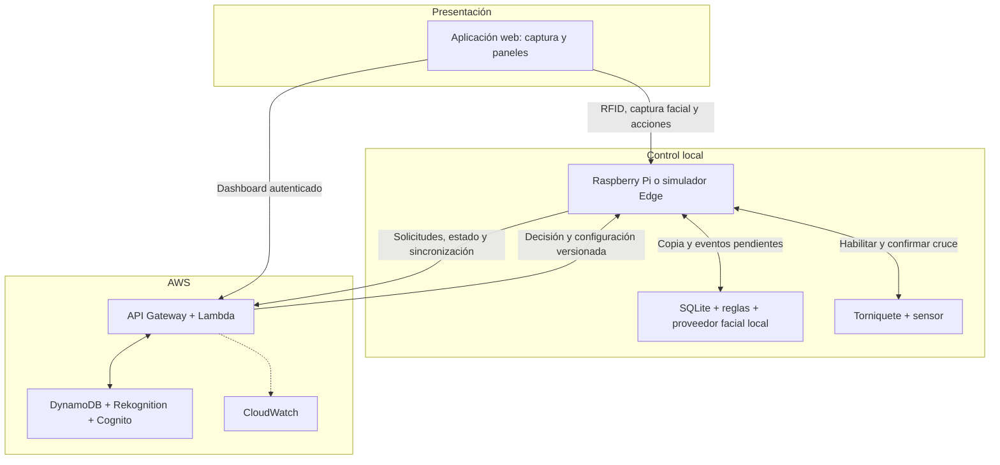
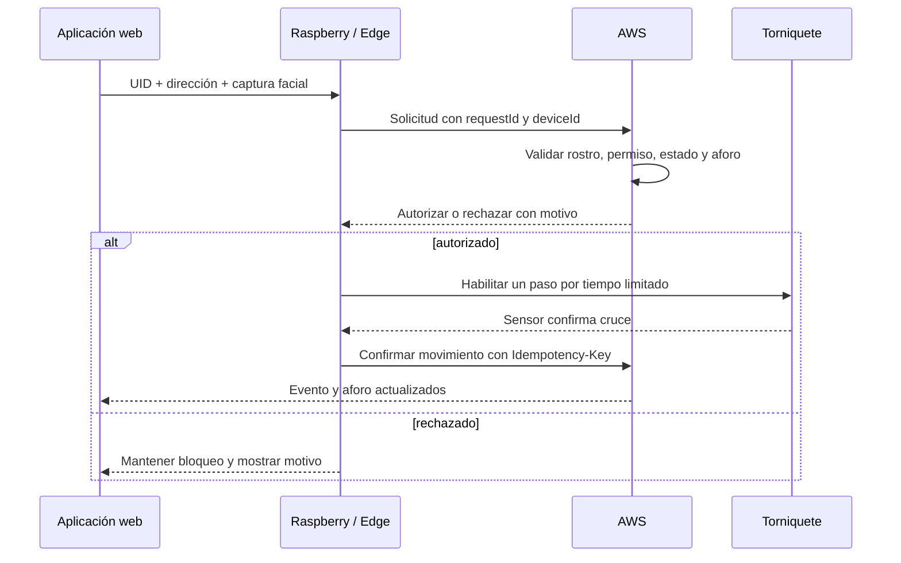
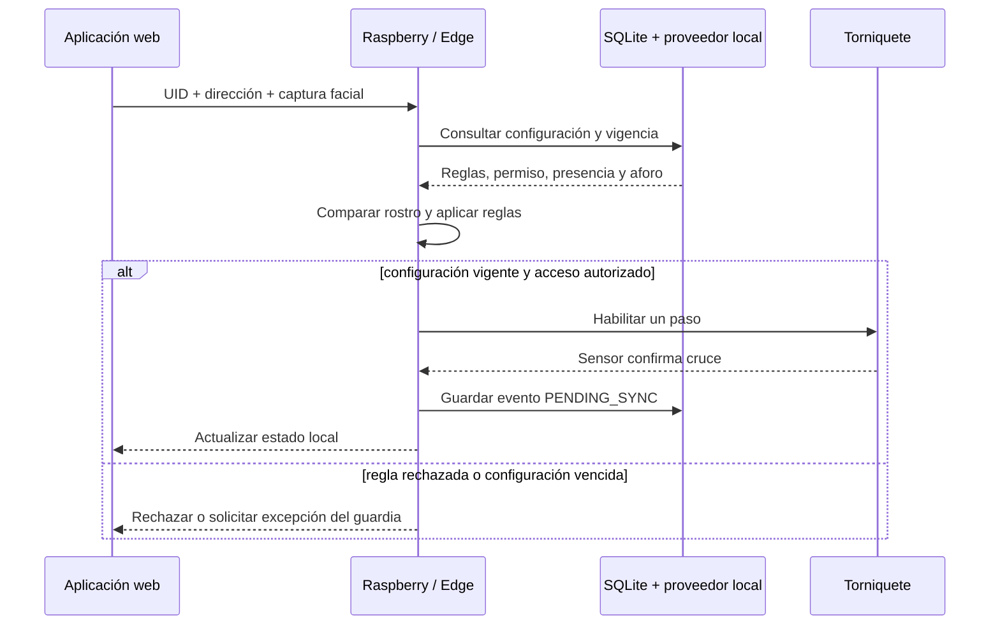
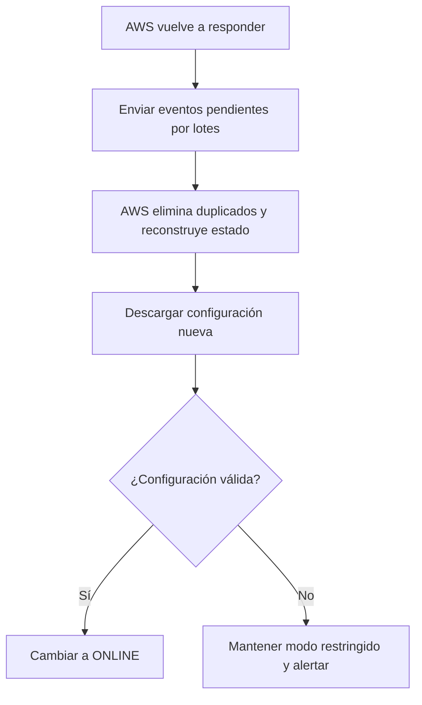

# Arquitectura híbrida — Diseño 2.0

## 1. Propósito y alcance

El sistema simula el control de acceso de una oficina mediante tarjeta RFID y validación facial conjunta. La aplicación web captura los datos y muestra el resultado, pero no toma decisiones de seguridad. La plataforma procesa la solicitud mediante AWS cuando está disponible y mediante un controlador local compatible con Raspberry Pi cuando no existe conexión con AWS.

El diseño mantiene las reglas ya definidas: permisos vigentes, tarjeta activa, coincidencia facial, anti-passback, aforo máximo, autorización de un solo paso, confirmación por sensor, visitantes temporales y auditoría.

La primera versión contempla una ubicación con un único servicio Edge responsable de las decisiones offline. Coordinar varios accesos independientes durante una misma caída de red queda fuera del alcance inicial porque podría producir conflictos de aforo y anti-passback.

## 2. Decisiones principales

| Pregunta | Decisión | Motivo |
|:---|:---|:---|
| ¿Qué hace la aplicación web? | Captura RFID/rostro y presenta información | Las decisiones críticas no deben depender del navegador |
| ¿Quién decide con conexión? | AWS Lambda con información de DynamoDB y resultado facial | AWS es la fuente central y oficial |
| ¿Quién compara el rostro online? | Amazon Rekognition o `MOCK` durante desarrollo | Permite validar en la plataforma, no en la PC |
| ¿Quién decide sin AWS? | Servicio Edge en Raspberry Pi o simulador local | Mantiene una continuidad controlada |
| ¿Dónde se guarda el respaldo local? | SQLite | Es liviano, local y no requiere un servidor separado |
| ¿Cada cuánto se actualiza? | Al iniciar, cada 5 minutos y al recuperar conexión | Reduce el tiempo con permisos desactualizados |
| ¿Cuánto dura la configuración offline? | 12 horas desde la última sincronización correcta | Equilibra continuidad y seguridad |
| ¿Quién controla el torniquete? | Raspberry Pi o simulador Edge | El actuador queda cerca del punto de acceso |
| ¿Cuál es el protocolo inicial? | HTTP local y HTTPS con API Gateway | Conserva la API actual y reduce complejidad |

AWS IoT Core y MQTT se evaluarán posteriormente. El Diseño 2.0 no depende de ellos ni de servicios que todavía no se hayan comprobado en Learner Lab.

## 3. Arquitectura lógica por capas

1. **Campo:** lector RFID, cámara, sensor de paso y torniquete.
2. **Presentación:** aplicación React para terminal, guardia y administrador.
3. **Control local o Edge:** Raspberry Pi o simulador que coordina la solicitud, mantiene la copia offline y controla el torniquete.
4. **Backend cloud:** API Gateway y Lambda aplican las reglas online y coordinan la sincronización.
5. **Procesamiento facial:** `MOCK` inicialmente, Rekognition online y proveedor `LOCAL` para pruebas offline.
6. **Datos:** DynamoDB como fuente oficial y SQLite como copia local temporal.
7. **Observabilidad:** dashboard y CloudWatch muestran eventos, errores y estado del dispositivo.

## 4. Vista general

La Raspberry participa siempre en el flujo del punto de acceso. No espera apagada a que falle internet: con AWS disponible actúa como puerta de enlace y sin AWS aplica temporalmente la última configuración válida.

## 5. Responsabilidad de cada componente

### Aplicación web

- Captura una imagen desde la webcam o utiliza una identidad ficticia.
- Simula o recibe el UID RFID.
- Envía la solicitud al servicio Edge.
- Muestra autorizado, rechazado, aforo, alertas y motivo.
- Presenta un panel limitado al guardia y otro completo al administrador.
- No compara rostros ni decide si una persona puede ingresar.

### Raspberry Pi o simulador Edge

- Identifica el dispositivo y la ubicación.
- Comprueba si AWS está disponible, no solamente si existe internet.
- Reenvía solicitudes a AWS durante el modo online.
- Aplica reglas locales solo cuando existe una configuración vigente.
- Mantiene SQLite con configuración, presencia, aforo y eventos pendientes.
- Procesa el rostro mediante proveedor `LOCAL` durante el modo offline.
- Habilita un único paso y espera la confirmación del sensor.
- Sincroniza eventos y configuración al recuperar AWS.

### AWS

- Autentica guardias y administradores.
- Mantiene personas, tarjetas, permisos, visitantes y políticas oficiales.
- Procesa la comparación facial online.
- Aplica permisos, anti-passback, aforo e idempotencia.
- Emite una configuración Edge versionada y con vencimiento.
- Recibe eventos offline sin duplicarlos.
- Mantiene auditoría sin capturas faciales ni secretos.

## 6. Flujo online

La autorización no equivale a una entrada. El aforo y la presencia cambian solamente después de la confirmación del sensor.

## 7. Flujo offline

Solo se autorizarán automáticamente identidades y permisos que hayan sido sincronizados. Una tarjeta o persona desconocida se rechazará. Los visitantes previamente autorizados podrán usar su permiso vigente; una visita creada offline requerirá una excepción limitada y auditada del guardia.

## 8. Sincronización de reglas y parámetros

AWS publicará una instantánea de configuración por ubicación y dispositivo. La Raspberry la solicitará:

- al iniciar;
- cada 5 minutos;
- al detectar una nueva versión;
- al recuperar conexión con AWS;
- por orden manual autorizada.

La instantánea incluirá datos, no código ejecutable:

- versión, fecha de generación, vencimiento e integridad verificable;
- personas y tarjetas habilitadas para funcionamiento offline;
- perfiles faciales locales mínimos y protegidos, generados para el proveedor `LOCAL`;
- tarjetas bloqueadas o perdidas conocidas;
- permisos y horarios;
- visitantes vigentes;
- aforo máximo, presencia y ocupación inicial;
- anti-passback y duración de autorizaciones;
- modo de emergencia y parámetros del proveedor facial local.

El servicio Edge validará la versión, el checksum y la firma antes de reemplazar la copia anterior. Una descarga incompleta o inválida no borrará la última configuración válida. El dashboard mostrará versión, última sincronización y vencimiento.

## 9. Recuperación de la conexión

Cada evento utilizará `eventId`, `requestId`, `deviceId`, `occurredAt`, `operationMode` e `Idempotency-Key`. Los eventos son anexables: no se reemplazan registros anteriores para resolver conflictos.

## 10. Modos de operación

| Modo | Condición | Comportamiento |
|:---|:---|:---|
| `ONLINE` | AWS responde y la sincronización es correcta | AWS decide y DynamoDB registra |
| `OFFLINE_VALID` | AWS no responde y la copia tiene menos de 12 horas | Raspberry decide con información local |
| `OFFLINE_EXPIRED` | La copia cumplió 12 horas sin actualizarse | Entradas automáticas restringidas; salidas permitidas |
| `SYNCING` | AWS regresó y existen eventos pendientes | Se envían eventos y se descargan reglas |
| `LOCKDOWN` | Emergencia, configuración inválida o bloqueo administrativo | Entradas bloqueadas; se conserva la salida segura |

Los estados de una solicitud individual se mantienen separados en [estados-acceso.md](estados-acceso.md). Los detalles de continuidad se encuentran en [modos-operacion.md](modos-operacion.md).

## 11. Recorrido y ubicación de los datos

| Información | Origen | Procesamiento | Almacenamiento oficial | Copia local |
|:---|:---|:---|:---|:---|
| UID RFID | Lector o web | AWS/Edge | DynamoDB | SQLite limitada |
| Captura facial online | Webcam | Rekognition | No se conserva | Memoria temporal |
| Captura facial offline | Webcam/cámara Pi | Proveedor `LOCAL` | No se conserva | Memoria temporal |
| Personas y permisos | Administrador | Lambda | DynamoDB | Instantánea SQLite |
| Visitantes | Guardia | Lambda o excepción offline | DynamoDB | Vigentes y pendientes |
| Aforo y presencia | Sensor confirmado | AWS/Edge | DynamoDB | SQLite |
| Evento online | Raspberry | Lambda | DynamoDB | Confirmación temporal |
| Evento offline | Raspberry | Edge | DynamoDB después de sincronizar | Cola `PENDING_SYNC` |
| Usuarios de dashboard | Administrador | Cognito | Cognito | Sesión limitada, sin contraseñas |

## 12. Comunicaciones

| Origen | Destino | Protocolo inicial | Contenido |
|:---|:---|:---|:---|
| Aplicación local | Raspberry/Edge | HTTP en red local | RFID, captura temporal, dirección y acciones |
| Raspberry/Edge | API Gateway | HTTPS | Solicitudes, confirmaciones, estado y sincronización |
| Dashboard | Cognito/API Gateway | HTTPS | Login, consultas y operaciones por rol |
| Edge | SQLite | Acceso local | Configuración y eventos pendientes |
| Edge | Torniquete/sensor | GPIO o simulación | Habilitación y confirmación |

No se guardarán credenciales AWS en el navegador ni en GitHub. El dispositivo utilizará una identidad propia y secretos fuera del repositorio.

## 13. Distribución del simulador

En la primera implementación no se necesita una Raspberry física:

| Equipo | Función posible |
|:---|:---|
| PC 1 | Servicio Edge simulado, RFID, webcam y torniquete virtual |
| PC 2 | Panel limitado del guardia |
| PC 3 opcional | Dashboard administrativo |

El mismo contrato permitirá trasladar el servicio Edge desde el computador a una Raspberry Pi 4. La aplicación React podrá publicarse en AWS y también compilarse para servir las funciones esenciales desde la red local cuando no haya internet.

## 14. Fallos previstos

| Falla | Respuesta |
|:---|:---|
| Internet o AWS inaccesible | Cambiar a `OFFLINE_VALID` si la copia sigue vigente |
| Configuración con más de 12 horas | Cambiar a `OFFLINE_EXPIRED` |
| Descarga dañada | Conservar la última versión válida y alertar |
| Evento repetido | Devolver el resultado anterior mediante idempotencia |
| Captura facial inválida | Rechazar sin guardar la imagen |
| SQLite no disponible | Bloquear entradas automáticas y permitir salida segura |
| Sensor no confirma | Cancelar autorización sin modificar aforo |
| Corte eléctrico | Fuera del alcance inicial; UPS y RTC quedan como mejora física |

## 15. Servicios AWS iniciales

| Servicio | Uso |
|:---|:---|
| Amazon API Gateway | API HTTPS `/api/v1` |
| AWS Lambda | Reglas online, configuración y sincronización |
| Amazon DynamoDB | Fuente oficial de personas, tarjetas, políticas y eventos |
| Amazon Cognito | Autenticación y roles del dashboard |
| Amazon Rekognition | Comparación facial online controlada |
| Amazon S3/Amplify | Publicación del frontend si Learner Lab lo permite |
| Amazon CloudWatch | Logs técnicos, métricas y alertas |

No se utilizarán inicialmente EC2, RDS, NAT Gateway, AppSync ni servidores permanentes. La infraestructura continuará definida mediante AWS SAM o CloudFormation para poder reconstruirla en otra cuenta.

## 16. API v1

Las rutas actuales se conservan y se agregan contratos de continuidad:

| Método | Ruta | Uso |
|:---|:---|:---|
| `GET` | `/api/v1/health` | Comprobar disponibilidad real de AWS |
| `POST` | `/api/v1/access-requests` | Crear solicitud RFID |
| `POST` | `/api/v1/access-requests/{id}/face-verification` | Procesar rostro online |
| `POST` | `/api/v1/access-requests/{id}/confirm` | Confirmar el sensor |
| `GET` | `/api/v1/edge/config` | Consultar configuración versionada |
| `POST` | `/api/v1/edge/events/sync` | Sincronizar eventos offline por lotes |
| `POST` | `/api/v1/edge/status` | Informar modo y salud del dispositivo |
| `GET` | `/api/v1/occupancy` | Consultar aforo |
| `GET` | `/api/v1/events` | Consultar auditoría según rol |
| `POST` | `/api/v1/visitors` | Crear visitante diario |

Contrato conceptual: [openapi.yaml](openapi.yaml).

## 17. Decisiones pendientes de implementación

- Modelo facial local que entregue rendimiento aceptable en Raspberry Pi 4.
- Mecanismo definitivo de autenticación del dispositivo compatible con Learner Lab.
- Disponibilidad de Cognito, Rekognition y hosting en el laboratorio.
- Umbral facial local y pruebas de iluminación.
- Accesorios físicos futuros: cámara, lector RFID, sensor, actuador, UPS y RTC.
- Evaluación posterior de MQTT/AWS IoT Core si aporta una ventaja comprobable.
- Coordinación offline de varios torniquetes o servicios Edge en una misma ubicación.
