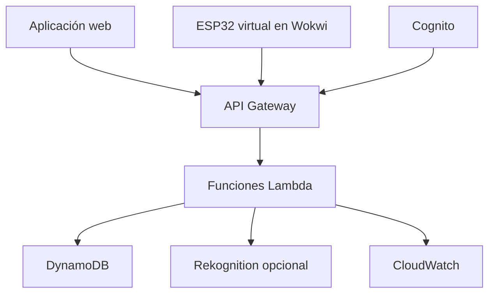

# Arquitectura prevista

## Propósito

Este documento define cómo se comunicarán la aplicación web, Wokwi y AWS. La arquitectura se mantendrá desacoplada para que cada parte pueda desarrollarse y probarse por separado.

## Componentes

## Responsabilidades

### Aplicación web

- Capturar o simular el rostro.
- Mostrar las solicitudes pendientes.
- Entregar los paneles de guardia y administrador.
- Consultar aforo, personas presentes y movimientos.
- Registrar visitantes y reportar tarjetas perdidas.

### Wokwi

- Leer tarjetas virtuales con MFRC522.
- Enviar el UID, dirección e identificador del torniquete.
- Consultar el resultado de la solicitud.
- Mover el servomotor únicamente cuando AWS autorice.
- Confirmar el cruce mediante un sensor virtual.

### AWS

- Autenticar a guardias y administradores.
- Relacionar RFID, rostro y persona.
- Aplicar permisos, anti-passback y aforo.
- Generar autorizaciones de un solo uso y corta duración.
- Guardar eventos y mantener el estado actual.

## API prevista

| Método | Ruta conceptual | Uso |
|:---|:---|:---|
| `POST` | `/access/request` | Crear solicitud después de leer RFID |
| `POST` | `/access/{id}/face` | Asociar validación facial |
| `GET` | `/access/{id}` | Consultar autorización o rechazo |
| `POST` | `/access/{id}/confirm` | Confirmar cruce del sensor |
| `GET` | `/occupancy` | Obtener aforo actual |
| `GET` | `/presence` | Consultar quién está dentro |
| `GET` | `/events` | Consultar historial autorizado |
| `POST` | `/visitors` | Registrar una visita temporal |
| `POST` | `/cards/{uid}/report-lost` | Bloquear una tarjeta reportada |

Las rutas son preliminares y podrán ajustarse sin cambiar la separación entre frontend, backend, infraestructura y Wokwi.

## Sincronización entre computadores

En la primera versión, la aplicación web y Wokwi consultarán el estado cada uno o dos segundos. Esta estrategia es suficiente para el prototipo y evita agregar WebSockets antes de que la lógica principal esté comprobada.

## Portabilidad entre cuentas

- No incluir números de cuenta ni URL fijas dentro de la lógica.
- Utilizar variables como `AWS_REGION`, `API_BASE_URL` y nombres de tablas.
- Definir los recursos futuros mediante CloudFormation o AWS SAM.
- Mantener datos ficticios en archivos independientes.
- Exportar los datos necesarios antes de agotar los créditos.
