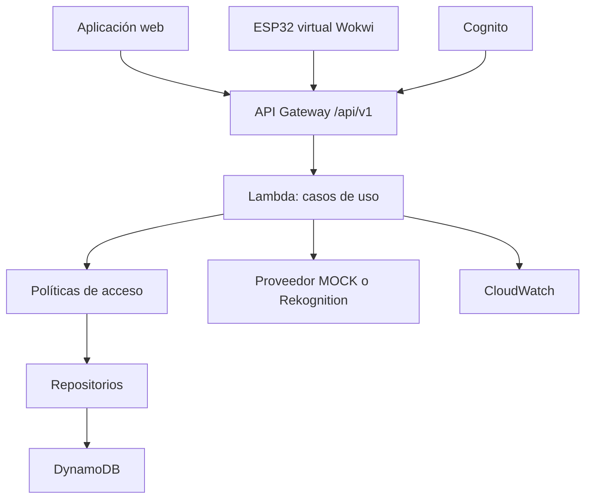

# Arquitectura prevista — Diseño 1.1

## Propósito

La aplicación web, Wokwi y AWS se conectarán mediante una API versionada. Las reglas serán independientes de Rekognition, DynamoDB y la cuenta de Learner Lab.

## Responsabilidades

### Aplicación web

- Simular RFID, cámara, dashboards y método alternativo.
- Eliminar la captura local después de la comparación.
- Mostrar solo las funciones permitidas a cada rol.

### Wokwi

- Enviar `source=WOKWI`, UID, `deviceId`, `locationId` y dirección.
- Consultar una solicitud existente, habilitar un paso en `AUTHORIZED` y confirmar el sensor.
- Mantener el torniquete bloqueado ante fallas.

### AWS

- Autenticar y autorizar por permisos.
- Aplicar tarjeta, rostro, permisos, anti-passback, aforo y privacidad.
- Confirmar el cruce de forma idempotente y transaccional.
- Emitir eventos sin fotografías ni secretos.
- Ejecutar vencimiento y conservación.

## Capas del backend

| Capa | Responsabilidad |
|:---|:---|
| Controladores | Solicitudes HTTP |
| Casos de uso | Coordinación |
| Políticas | Decisión de acceso |
| Proveedores faciales | `MOCK` o `REKOGNITION` |
| Repositorios | Persistencia desacoplada |
| Auditoría | Eventos y códigos |

## API v1

Se preferirá **API Gateway HTTP API** si las funciones de autenticación permitidas por Learner Lab son suficientes. Su precio público inicial es menor que el de REST API. REST API se utilizará solo si una necesidad técnica concreta lo justifica.

| Método | Ruta |
|:---|:---|
| `POST` | `/api/v1/access-requests` |
| `POST` | `/api/v1/access-requests/{id}/face-verification` |
| `GET` | `/api/v1/access-requests/{id}` |
| `POST` | `/api/v1/access-requests/{id}/confirm` |
| `GET` | `/api/v1/occupancy` |
| `GET` | `/api/v1/presence` |
| `GET` | `/api/v1/events` |
| `POST` | `/api/v1/visitors` |
| `POST` | `/api/v1/cards/{uid}/report-lost` |

Contrato: [openapi.yaml](openapi.yaml).

## Sincronización, tiempo y portabilidad

- Polling inicial cada uno o dos segundos; WebSocket queda como mejora.
- `requestId` e `Idempotency-Key` evitan duplicados.
- Fechas en UTC y visualización en `America/Santiago`.
- Variables para región, URL, tablas y proveedor.
- AWS SAM o CloudFormation según permisos.
- Sin EC2, RDS ni NAT Gateway inicialmente.
- `FACE_PROVIDER=MOCK`, TTL de solicitudes y retención corta de logs para cuidar créditos.
- Presupuesto interno máximo recomendado: USD 10 para desarrollo y demostración.
- Respaldo de infraestructura, configuración y datos ficticios antes de cambiar de cuenta.

Plan detallado: [costos-y-migracion-aws.md](costos-y-migracion-aws.md).
