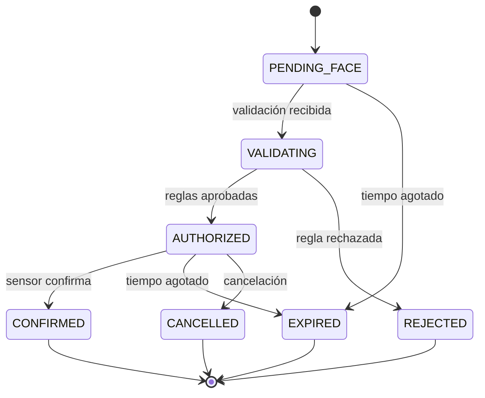

# Estados del acceso

| Estado | Significado |
|:---|:---|
| `PENDING_FACE` | RFID aceptado; espera rostro o alternativa |
| `VALIDATING` | Se evalúan identidad y políticas |
| `AUTHORIZED` | Permite un único cruce |
| `CONFIRMED` | Sensor confirmado y sistema actualizado |
| `REJECTED` | Una regla impidió el acceso |
| `EXPIRED` | No se completó a tiempo |
| `CANCELLED` | Cancelación controlada |

## Reglas

- Un estado terminal no vuelve a `AUTHORIZED`.
- Una confirmación repetida devuelve el resultado previo.
- El torniquete solo se mueve en `AUTHORIZED`.
- El aforo solo cambia en `CONFIRMED`.
- Ante error técnico, el torniquete sigue bloqueado.

## Códigos

`CARD_UNKNOWN`, `CARD_BLOCKED`, `CARD_LOST`, `FACE_MISMATCH`, `FACE_PROVIDER_ERROR`, `PERMISSION_DENIED`, `PERMISSION_EXPIRED`, `ALREADY_INSIDE`, `ALREADY_OUTSIDE`, `CAPACITY_FULL`, `ACTIVE_REQUEST_EXISTS`, `DEVICE_UNKNOWN`, `REQUEST_EXPIRED`, `UNAUTHORIZED` y `FORBIDDEN`.
