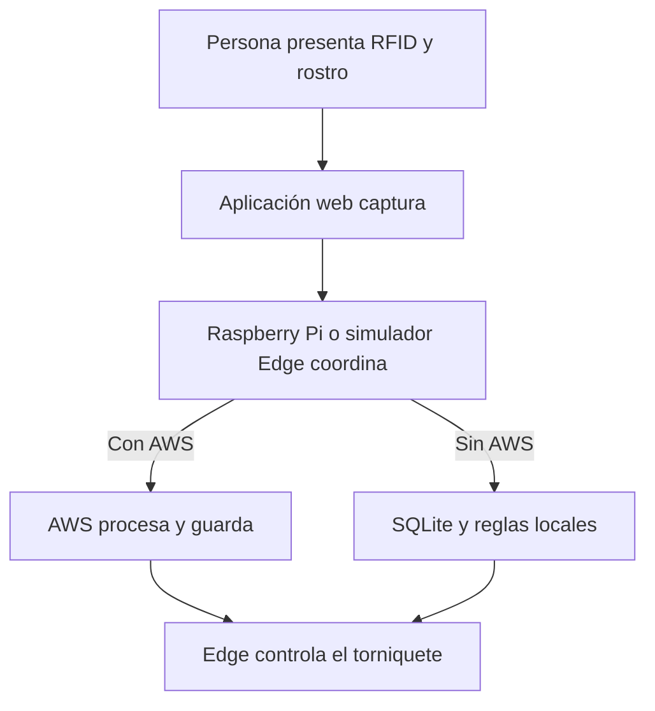

# Guía sencilla para entender el proyecto

## ¿Para quién es esta guía?

Para integrantes, profesores o compañeros que no conozcan AWS, Raspberry Pi, RFID, bases de datos o aplicaciones web. La explicación evita detalles innecesarios y se concentra en qué hace cada parte.

## El proyecto en una frase

Simularemos una oficina donde una persona presenta una tarjeta RFID y su rostro; la plataforma revisa su identidad y permiso, habilita un solo paso, confirma el cruce y actualiza el aforo.

## Un acceso normal

1. La persona presenta una tarjeta.
2. La aplicación obtiene su código RFID.
3. La webcam captura temporalmente el rostro.
4. La PC envía ambos datos al servicio Edge.
5. Si AWS está disponible, la plataforma cloud procesa la solicitud.
6. Si AWS no está disponible, el Edge usa su copia local vigente.
7. Se revisan tarjeta, rostro, permiso, presencia y aforo.
8. El torniquete permite un solo paso o permanece bloqueado.
9. El sensor confirma si la persona realmente cruzó.
10. El sistema registra el resultado y actualiza el aforo.

## Las partes principales

## GitHub: la carpeta compartida

GitHub guarda el código y la documentación. Además, registra quién cambió cada archivo y permite revisar los cambios mediante Pull Requests antes de incorporarlos a `main`.

## Visual Studio Code: donde programamos

Visual Studio Code es el editor utilizado para escribir y probar el proyecto. No es la aplicación final ni guarda los registros de la oficina.

## Aplicación web: la pantalla

La aplicación se construye con React, Vite y TypeScript. Tendrá:

- terminal de RFID y webcam;
- torniquete virtual;
- panel limitado del guardia;
- dashboard administrativo;
- aforo, personas presentes y eventos;
- estado online/offline;
- última sincronización y alertas.

La aplicación captura y muestra, pero no reconoce a una persona ni toma la decisión de abrir.

## Raspberry Pi: el controlador local

Una Raspberry Pi es un computador pequeño que puede ejecutar Linux, utilizar una cámara, conectarse a un lector RFID, guardar datos locales y controlar sensores o actuadores.

En este proyecto será la puerta de enlace del acceso:

- recibe la información de la aplicación;
- consulta AWS cuando está disponible;
- aplica reglas locales durante una interrupción;
- controla el torniquete;
- confirma el sensor;
- sincroniza lo ocurrido al volver AWS.

Al comienzo no necesitamos comprarla. Ejecutaremos en un computador un servicio que imita su comportamiento. Luego podremos trasladarlo a una Raspberry Pi 4.

## Servicio Edge: el programa de la Raspberry

“Edge” significa que una parte del procesamiento ocurre cerca del dispositivo, en lugar de depender siempre de internet. El servicio Edge funcionará en la Raspberry o en el simulador del computador.

La Raspberry no es una segunda base oficial. AWS continúa siendo la fuente principal; Edge conserva una copia controlada para emergencias.

## RFID: la tarjeta

RFID permite leer un identificador llamado UID cuando una tarjeta se acerca al lector. El UID no contiene el nombre: se utiliza para buscar a qué persona pertenece. En las pruebas usaremos códigos ficticios.

## AWS: la plataforma central

AWS es un conjunto de servicios cloud. En el modo online será la plataforma que autentica usuarios, aplica las reglas, compara el rostro y guarda la información compartida.

### API Gateway

Es la entrada HTTPS del backend. Recibe solicitudes del servicio Edge y el dashboard y las entrega a Lambda.

### Lambda

Ejecuta las reglas:

- tarjeta activa y no perdida;
- rostro correspondiente;
- permiso vigente;
- persona actualmente fuera o dentro;
- aforo disponible;
- visitante vigente;
- dispositivo autorizado.

También prepara reglas para Edge y recibe eventos offline.

### DynamoDB

Es la base oficial. Guarda personas, tarjetas, visitantes, permisos, presencia, aforo, solicitudes y eventos. No guarda capturas faciales temporales.

### Cognito

Gestiona el inicio de sesión y separa los permisos del guardia y el administrador.

### Rekognition

Compara el rostro durante el modo online. Entrega un resultado facial; Lambda toma la decisión final considerando todas las reglas.

### CloudWatch

Permite revisar errores y funcionamiento del backend. Sus logs no deben contener imágenes, tokens ni documentos personales completos.

### AWS SAM y CloudFormation

Son el plano para reconstruir los recursos AWS en otra cuenta de Learner Lab sin configurarlos nuevamente a mano.

## SQLite: la libreta local

SQLite es una base de datos pequeña que funciona dentro del servicio Edge. Guardará temporalmente:

- última versión de reglas;
- personas y tarjetas habilitadas para el lugar;
- tarjetas bloqueadas conocidas;
- permisos y visitantes vigentes;
- aforo y presencia local;
- eventos pendientes de sincronización.

No contendrá contraseñas de Cognito ni fotografías guardadas.

## Diferencia entre capturar y procesar una cara

- **Capturar:** la webcam obtiene una imagen temporal.
- **Procesar:** un motor compara la cara con un perfil autorizado.
- **Decidir:** se combinan rostro, tarjeta, permiso, presencia y aforo.

La aplicación web solo captura. Rekognition procesa online y la Raspberry procesa offline. Lambda o el servicio Edge aplican las reglas según el modo. Durante la simulación, el servicio Edge puede ejecutarse como un proceso separado en el mismo computador, pero representa una plataforma distinta del navegador y luego se trasladará a la Raspberry.

## ¿Cómo funciona con AWS?

1. La web envía RFID y captura al Edge.
2. Edge crea un identificador único y consulta AWS.
3. Rekognition compara el rostro.
4. Lambda revisa las demás reglas.
5. AWS responde autorizado o rechazado.
6. Edge controla el torniquete.
7. El sensor confirma el cruce.
8. DynamoDB guarda el movimiento.

## ¿Cómo funciona sin AWS?

1. Edge detecta que AWS no responde.
2. Comprueba que su copia tenga menos de 12 horas.
3. Consulta RFID, permisos, presencia y aforo en SQLite.
4. El proveedor local compara el rostro.
5. Edge autoriza o rechaza.
6. El sensor confirma el cruce.
7. SQLite guarda el evento como pendiente.

Solo se aceptan automáticamente personas y permisos previamente sincronizados.

## ¿Qué pasa después de 12 horas?

El sistema entra en modo restringido porque sus permisos podrían estar desactualizados:

- las salidas siguen permitidas;
- las entradas automáticas se bloquean;
- el guardia recibe una alerta;
- una excepción requiere usuario y motivo;
- los eventos permanecen guardados hasta recuperar AWS.

## ¿Qué pasa cuando vuelve AWS?

Edge envía los eventos pendientes, AWS evita duplicados, reconstruye el estado, entrega las reglas nuevas y confirma el retorno al modo online.

## ¿Qué significa anti-passback?

Una persona que aparece dentro no puede marcar otra entrada. Primero debe registrar su salida. Esto dificulta el uso de una tarjeta perdida o prestada.

## ¿Por qué se necesita un sensor?

Una autorización significa “puede pasar”, no “ya pasó”. El aforo cambia únicamente cuando el sensor confirma el cruce.

## Guardia y administrador

El guardia puede consultar aforo, personas presentes, alertas, visitantes y tarjetas perdidas. No puede crear trabajadores permanentes, cambiar políticas ni consultar perfiles biométricos.

El administrador puede gestionar personas, dispositivos, capacidad y permisos, además de revisar la auditoría completa.

## Uso desde varios computadores

- PC 1: servicio Edge simulado, RFID, webcam y torniquete virtual.
- PC 2: panel limitado del guardia.
- PC 3 opcional: dashboard administrativo.

Con AWS disponible comparten la información central. Durante una interrupción, las funciones esenciales del punto de acceso utilizan la red local y la Raspberry.

## Privacidad

La primera etapa utilizará identidades ficticias. Si se prueba una persona real:

- se informa la finalidad;
- se solicita la autorización que corresponda;
- la captura se elimina después de comparar;
- se ofrece un método alternativo;
- el guardia no accede al perfil facial;
- los datos locales reciben la misma protección que los datos cloud.

## Costos

El desarrollo utilizará `MOCK` la mayor parte del tiempo. Rekognition se probará pocas veces, no habrá servidores permanentes y el Edge descargará datos completos solo cuando cambie la versión. El objetivo interno continúa siendo no superar USD 10 del crédito disponible durante el prototipo.

## Carpetas

| Carpeta | Contenido |
|:---|:---|
| `frontend/` | Aplicación web y dashboards |
| `backend/` | Reglas y funciones AWS |
| `edge/` | Simulador local y futuro programa Raspberry Pi |
| `infrastructure/` | Plano para reconstruir AWS |
| `docs/` | Arquitectura, decisiones y pruebas |
| `data/` futura | Datos ficticios y configuraciones de ejemplo |
| `scripts/` futura | Respaldo, migración y utilidades |

## Resumen

- La web captura y muestra.
- Raspberry/Edge coordina y controla el torniquete.
- AWS decide y guarda cuando está disponible.
- SQLite mantiene una copia local limitada.
- Rekognition procesa el rostro online.
- El proveedor local lo procesa offline.
- Las reglas se actualizan cada 5 minutos.
- La configuración offline dura 12 horas.
- Al volver AWS se sincronizan los eventos sin duplicarlos.
