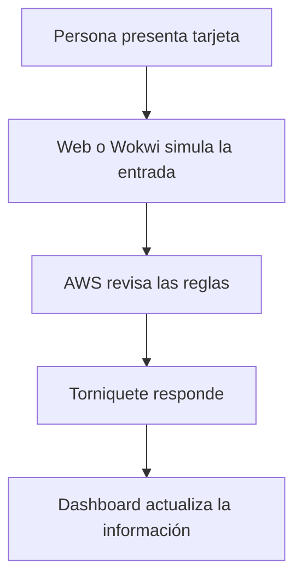

# Guía sencilla para entender el proyecto

## ¿Para quién es esta guía?

Para integrantes del equipo, profesores o compañeros que no conozcan AWS, Wokwi, RFID, bases de datos o aplicaciones web.

Aquí evitaremos las explicaciones complicadas. La idea es entender qué hace cada parte y cómo se relaciona con las demás.

## El proyecto explicado en una frase

Vamos a crear una **oficina simulada** en la que una persona presenta una tarjeta, confirma su identidad y un torniquete virtual decide si puede entrar o salir.

El sistema también contará cuántas personas están dentro y guardará un historial.

## Un ejemplo cotidiano

Imaginemos la entrada de una empresa:

1. Una persona acerca su tarjeta.
2. El sistema busca a quién pertenece.
3. La persona muestra su rostro o utiliza un método alternativo.
4. Se comprueba que tenga permiso.
5. Se revisa que no aparezca ya dentro.
6. Se revisa que la oficina no esté llena.
7. Si todo está correcto, el torniquete permite un paso.
8. Un sensor confirma que realmente cruzó.
9. El sistema actualiza el número de personas.
10. El guardia ve el resultado en su pantalla.

Nuestro proyecto imitará todo eso sin instalar todavía un torniquete físico.

## Las partes principales

## ¿Qué es cada programa o servicio?

### GitHub: la carpeta compartida del equipo

GitHub es el lugar donde se guarda el proyecto.

Se parece a una carpeta compartida, pero además recuerda quién cambió cada archivo y permite revisar los cambios antes de aceptarlos.

En este proyecto guardará:

- El código de la aplicación web.
- El código de AWS.
- El circuito de Wokwi.
- Los documentos.
- Los cambios realizados por cada integrante.

La versión principal se llama `main`. Para trabajar sin romperla se crean ramas y Pull Requests.

### Visual Studio Code: el lugar donde programamos

Visual Studio Code es el editor en el que escribiremos el código.

Se parece a Word, pero está preparado para programar. Desde allí podremos abrir las carpetas del repositorio, modificar archivos y probar la aplicación.

Visual Studio Code no es la aplicación final ni almacena los datos en Internet. Es nuestro espacio de trabajo.

### Aplicación web: la pantalla principal

Será una página que podrá abrirse desde el navegador.

Representará:

- El lector RFID cuando no usemos Wokwi.
- La cámara o identidad facial ficticia.
- El torniquete virtual.
- El panel del guardia.
- El dashboard del administrador.
- El aforo y el historial.

La aplicación se programará en Visual Studio Code, pero se utilizará desde Chrome, Edge u otro navegador.

### Wokwi: la maqueta electrónica virtual

Wokwi permite colocar componentes electrónicos en una pantalla y hacer que funcionen como si fueran reales.

En nuestro proyecto mostrará:

- Un ESP32.
- Un lector RFID.
- Luces roja, amarilla y verde.
- Una pantalla pequeña.
- Un servomotor que representa el torniquete.
- Un sensor o botón que confirma el paso.

Es como tener la maqueta electrónica sin comprar los componentes.

### ESP32: el pequeño computador del torniquete

El ESP32 es una placa electrónica que puede leer sensores, controlar luces y conectarse a Internet.

En Wokwi será virtual. Leerá la tarjeta, enviará la información a AWS y esperará la respuesta.

Si AWS autoriza, moverá el servomotor. Si AWS rechaza, mantendrá el torniquete cerrado.

### RFID: la tarjeta de identificación

RFID es la tecnología de las tarjetas que se acercan a un lector.

Cada tarjeta tiene un código llamado UID. El UID no será el nombre de la persona; será una referencia que permitirá buscar a su propietario.

Durante las pruebas utilizaremos UID ficticios.

### AWS: el centro de control

AWS es una plataforma de servicios en Internet.

En este proyecto actuará como el cerebro central que conecta los computadores. Recibirá las solicitudes, revisará las reglas y guardará la información.

Gracias a AWS, un compañero podrá usar Wokwi en su computador mientras otro observa el dashboard desde otro lugar.

AWS no es un único programa. Está compuesto por diferentes servicios, cada uno con una tarea.

### API Gateway: la puerta de entrada de AWS

API Gateway recibe los mensajes enviados por la web o Wokwi.

Se parece a la recepción de un edificio: recibe la solicitud, comprueba a qué lugar debe enviarla y entrega una respuesta.

Ejemplo:

> Wokwi pregunta: “La tarjeta 01:02:03:04 quiere entrar. ¿La autorizo?”

API Gateway entrega esa pregunta a Lambda.

### Lambda: quien revisa las reglas

Lambda ejecuta las decisiones del sistema.

Revisará preguntas como:

- ¿La tarjeta existe?
- ¿Está bloqueada o perdida?
- ¿El rostro corresponde?
- ¿La persona tiene permiso?
- ¿Ya aparece dentro?
- ¿Hay espacio disponible?
- ¿El visitante sigue autorizado?

Después responderá “autorizado” o “rechazado”, junto con el motivo.

Lambda solo se ejecuta cuando recibe una solicitud. Por eso es apropiado para ahorrar créditos.

### DynamoDB: el registro central

DynamoDB es la base de datos.

Se puede imaginar como un conjunto de fichas digitales ordenadas. Guardará:

- Personas.
- Tarjetas.
- Visitantes.
- Permisos.
- Estado dentro o fuera.
- Aforo.
- Intentos autorizados y rechazados.
- Fecha y hora de los movimientos.

No guardará las capturas temporales del rostro.

### Cognito: el control de usuarios

Cognito se encargará del inicio de sesión.

Permitirá distinguir entre:

- Guardia.
- Administrador.

El guardia tendrá acceso a las funciones necesarias para controlar la entrada y registrar visitantes. El administrador podrá configurar personas, tarjetas, capacidad y permisos.

### Rekognition: la comparación facial opcional

Rekognition es el servicio de AWS que puede comparar rostros.

La primera versión no dependerá de él. Utilizaremos un modo ficticio llamado `MOCK`.

Cuando el sistema completo funcione, podremos probar Rekognition con pocas imágenes y los permisos correspondientes.

Rekognition no decidirá por sí solo si una persona entra. Únicamente entregará un resultado facial; Lambda aplicará todas las reglas.

### S3: el lugar para archivos de la web

S3 puede guardar los archivos necesarios para publicar una página web, como HTML, estilos e imágenes del diseño.

No se utilizará para guardar capturas faciales permanentes.

### CloudWatch: el cuaderno de errores

CloudWatch ayuda a saber qué ocurrió dentro de AWS.

Si una función falla, podremos revisar un registro para encontrar el problema. También puede mostrar cuántas veces se ejecutó una función.

Los registros se conservarán por poco tiempo para evitar gastos y acumulación innecesaria de datos.

### AWS SAM y CloudFormation: el plano para reconstruir AWS

Estas herramientas describen por escrito qué recursos necesita el proyecto.

Son parecidas al plano de una casa. Si se terminan los créditos de una cuenta, utilizaremos el mismo plano para crear los recursos en otra cuenta.

Así no tendremos que recordar manualmente cada botón presionado en AWS.

## ¿Cómo será una entrada completa?

### Paso 1: tarjeta

La persona presenta una tarjeta ficticia en Wokwi o en el simulador web.

### Paso 2: solicitud

El código de la tarjeta viaja a AWS.

### Paso 3: identidad

La aplicación web muestra la solicitud y realiza una validación facial ficticia o temporal.

### Paso 4: reglas

AWS revisa la tarjeta, la identidad, el permiso, el estado de la persona y el aforo.

### Paso 5: autorización

Si todo está correcto, AWS permite un solo paso durante un tiempo corto.

### Paso 6: torniquete

Wokwi enciende la luz verde y mueve el servomotor.

### Paso 7: confirmación

El sensor confirma que la persona cruzó. Recién entonces se registra la entrada y aumenta el aforo.

Si nadie cruza, la autorización vence y el contador no cambia.

## ¿Por qué no se registra apenas se autoriza?

Porque una persona podría validar su tarjeta y después no entrar.

El sensor separa dos cosas:

- Tener permiso para pasar.
- Haber pasado realmente.

Esto ayuda a mantener correcto el aforo.

## ¿Qué significa anti-passback?

Significa que una persona que aparece dentro no puede marcar otra entrada.

Primero deberá registrar su salida. Esto dificulta que otra persona utilice una tarjeta perdida o prestada.

## ¿Qué verá el guardia?

- Aforo actual.
- Personas presentes.
- Solicitudes recientes.
- Alertas.
- Registro de visitantes.
- Opción para reportar tarjetas perdidas.
- Solicitud de correcciones con motivo.

No podrá administrar todo el sistema ni ver información biométrica.

## ¿Qué verá el administrador?

Además de las funciones generales, podrá:

- Crear o desactivar personas.
- Asignar tarjetas.
- Configurar capacidad.
- Administrar permisos.
- Gestionar dispositivos.
- Revisar auditoría completa.

## ¿Cómo funciona desde dos computadores?

Ambos computadores consultarán el mismo sistema AWS.

Ejemplo:

- Computador 1: Wokwi y torniquete.
- Computador 2: aplicación web del guardia.
- Computador 3 opcional: dashboard del administrador.

No necesitan conectarse directamente entre ellos. AWS mantiene la información compartida.

## ¿Es un sistema real?

Es una simulación diseñada con reglas realistas.

No moverá inicialmente un torniquete físico ni será un sistema oficial de asistencia laboral. Sin embargo, su estructura permitirá reemplazar componentes virtuales por componentes físicos en el futuro sin rehacer todo.

## Datos personales y seguridad

Durante la primera etapa se usarán datos ficticios.

Si se prueban rostros reales:

- Se informará la finalidad.
- Se solicitará autorización cuando corresponda.
- La captura se eliminará después de comparar.
- Se ofrecerá un método alternativo.
- El guardia no verá la fotografía.
- Los registros se conservarán solo por el tiempo definido.

Las claves AWS nunca se guardarán en GitHub o Wokwi.

## ¿Gastará mucho dinero?

El diseño utiliza servicios que cobran principalmente cuando se usan.

Para controlar los USD 50:

- Se utilizará `MOCK` casi siempre.
- Rekognition se probará pocas veces.
- No se usarán servidores permanentes.
- Wokwi consultará solo mientras exista una solicitud.
- Los registros de CloudWatch tendrán conservación corta.
- Se revisará el saldo regularmente.

El objetivo interno es no superar USD 10 durante el prototipo.

## ¿Qué contiene cada carpeta?

| Carpeta | Explicación sencilla |
|:---|:---|
| `frontend/` | Aplicación web y dashboards |
| `backend/` | Reglas que ejecutará AWS |
| `infrastructure/` | Plano para crear los servicios AWS |
| `wokwi/` | Circuito y código del ESP32 |
| `docs/` | Explicaciones, decisiones y pruebas |
| `data/` futura | Personas y tarjetas ficticias |
| `scripts/` futura | Herramientas de respaldo y configuración |

## Estado actual

Actualmente existe el diseño y la documentación. Todavía no existe una aplicación funcionando.

La siguiente fase comenzará creando desde cero:

1. La aplicación web básica.
2. Una ruta de prueba en AWS.
3. La conexión web–AWS.
4. La conexión Wokwi–AWS.
5. Las reglas y la base de datos.
6. Los dashboards.
7. Las pruebas completas.

## Resumen final

- GitHub guarda y organiza el proyecto.
- Visual Studio Code sirve para programar.
- La web muestra la simulación y los dashboards.
- Wokwi representa la electrónica.
- AWS comunica todo y aplica las reglas.
- DynamoDB guarda los registros.
- Cognito separa guardia y administrador.
- Rekognition compara rostros de forma opcional.
- SAM permite reconstruir AWS en otra cuenta.

La idea más importante es que cada parte tiene una responsabilidad y todas se comunican mediante AWS.
