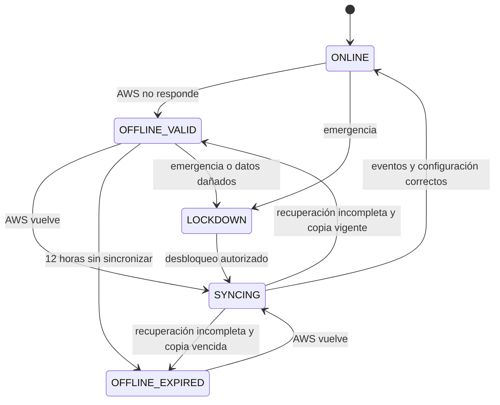

# Modos de operación y continuidad

## Propósito

Separar el estado general de la plataforma del estado de cada solicitud de acceso. Un acceso puede estar `AUTHORIZED` o `REJECTED`, mientras que el sistema completo puede operar online, offline o restringido.

## Estados

| Modo | Entrada automática | Salida | Guardia | Registro |
|:---|:---:|:---:|:---|:---|
| `ONLINE` | Sí, según AWS | Sí | Funciones según rol | DynamoDB |
| `OFFLINE_VALID` | Sí, solo datos sincronizados | Sí | Funciones esenciales | SQLite pendiente |
| `OFFLINE_EXPIRED` | No | Sí | Excepción limitada y auditada | SQLite pendiente |
| `SYNCING` | Restringida durante reconciliación | Sí | Solo consulta esencial | SQLite y AWS |
| `LOCKDOWN` | No | Sí | Procedimiento de emergencia | Auditoría local/cloud |

## Regla de 12 horas

La vigencia comienza con la última sincronización de configuración completada y validada. Reiniciar la Raspberry no reinicia el plazo. Si la configuración vence, el sistema no elimina los datos: conserva la evidencia, permite salidas y espera recuperación o una excepción autorizada.

## Detección de disponibilidad

El modo no se decide solamente comprobando internet. El servicio Edge consulta `/api/v1/health` y considera también errores repetidos, tiempo máximo de respuesta y validez de la respuesta. Un fallo temporal aislado no debe cambiar de modo inmediatamente.

## Política offline

- Solo se aceptan personas, tarjetas y permisos presentes en la instantánea válida.
- El aforo y anti-passback continúan localmente.
- Una identidad desconocida se rechaza.
- Una tarjeta bloqueada localmente se rechaza inmediatamente.
- Los visitantes sincronizados conservan su vencimiento original.
- Una excepción del guardia incluye usuario, motivo, hora y persona responsable.
- Las capturas faciales se eliminan después de procesarse.

## Retorno a online

1. Comprobar la identidad del servicio AWS.
2. Enviar eventos `PENDING_SYNC` en orden y por lotes.
3. Recibir confirmación idempotente por evento.
4. Recalcular presencia y aforo en AWS.
5. Descargar la última configuración.
6. Validar versión, integridad y vencimiento.
7. Cambiar a `ONLINE` y actualizar el dashboard.

